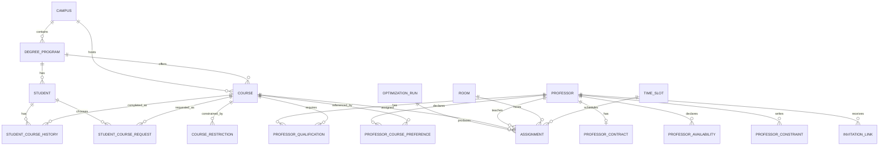
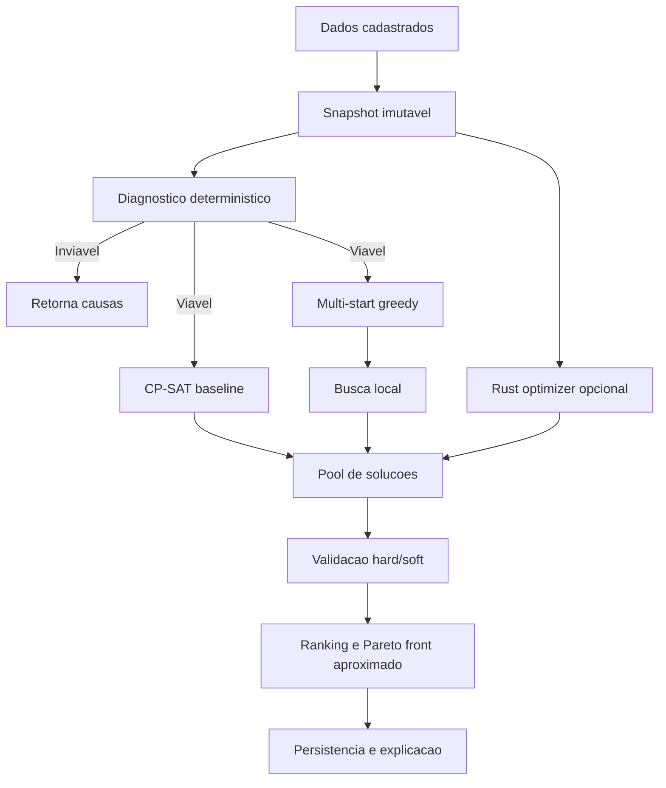
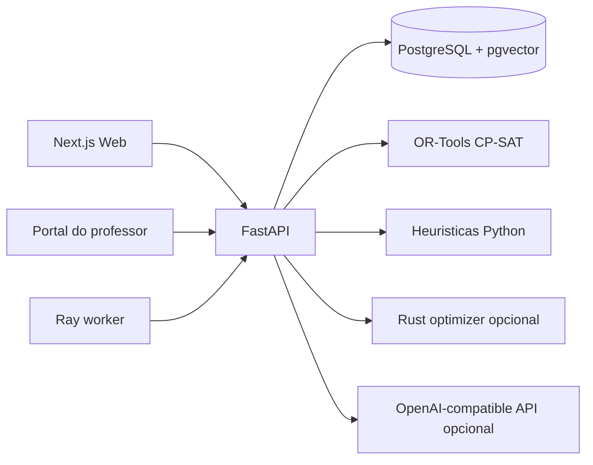

# OptiGrade: Sistema Inteligente de Otimizacao de Oferta de Disciplinas

**Projeto:** OptiGrade  
**Instituicao-alvo:** Universidade Federal de Pelotas (UFPel)  
**Area principal:** Pesquisa Operacional aplicada a sistemas academicos  
**Areas correlatas:** Otimizacao combinatoria, engenharia de software, sistemas de apoio a decisao, inteligencia artificial aplicada, UX para sistemas complexos  
**Versao do documento:** 0.2  
**Data:** 2026-05-03

---

## Resumo

O OptiGrade e um sistema computacional para apoio ao planejamento semestral de oferta de disciplinas em universidades publicas. O problema e tratado como uma variante do *University Course Timetabling Problem* (UCTP), uma classe de problema combinatorio em que disciplinas, professores, salas e horarios precisam ser alocados respeitando restricoes obrigatorias e otimizando preferencias institucionais, docentes e discentes.

O projeto implementa uma arquitetura local-first com frontend em Next.js, backend em FastAPI, persistencia em PostgreSQL com pgvector, otimizacao por portfolio de algoritmos e nucleo evolutivo opcional em Rust. A solucao combina verificacoes deterministicas, CP-SAT/OR-Tools, heuristicas multi-start, busca local, ranking multiobjetivo, interpretacao assistida por IA para restricoes docentes em linguagem natural e infraestrutura preparada para execucao paralela com Ray. O modelo academico distingue campus, curso de graduacao e cadeira, incluindo carga teorica/pratica e chaves de contexto para ofertas compartilhaveis entre cursos equivalentes.

No MVP, a previsao de demanda por aprendizado de maquina nao e implementada. A demanda prevista entra como dado manual ou importado. A contribuicao central do projeto nesta fase e fornecer uma plataforma operacional e extensivel para gerar, avaliar, explicar e ajustar grades academicas com rastreabilidade das decisoes.

**Palavras-chave:** timetabling universitario, CP-SAT, metaheuristicas, alocacao de professores, otimizacao multiobjetivo, restricoes docentes, FastAPI, Next.js.

---

## Abstract

OptiGrade is a decision-support system for semester course offering planning in public universities. The project models the task as a University Course Timetabling Problem, where courses, teachers, rooms, and time slots must be assigned under hard institutional constraints while optimizing soft preferences and service-quality criteria.

The implemented architecture combines a Next.js frontend, a FastAPI backend, PostgreSQL with pgvector, a portfolio optimization pipeline, and an optional Rust-based evolutionary optimizer. The first MVP includes deterministic feasibility checks, CP-SAT/OR-Tools, multi-start constructive heuristics, local search, multi-objective ranking, AI-assisted interpretation of teacher constraints, and Ray-ready worker infrastructure.

Demand forecasting is intentionally excluded from the current MVP and remains a future phase. The current system focuses on reliable schedule generation, constraint modeling, explainability, and academic decision support.

---

## 1. Contexto e Motivacao

O planejamento semestral de disciplinas em universidades publicas costuma envolver multiplos atores, sistemas fragmentados e regras parcialmente formalizadas. Coordenadores, chefes de departamento e pro-reitorias precisam decidir quais disciplinas abrir, em quais horarios, com quais professores e em quais salas. Ao mesmo tempo, devem respeitar carga horaria legal, disponibilidade docente, capacidade fisica, restricoes curriculares e demanda esperada.

Esse processo frequentemente e manual ou semi-manual, com forte dependencia de experiencia institucional. Essa abordagem pode funcionar em cenarios pequenos, mas tende a degradar quando o numero de cursos, disciplinas, turmas, salas e professores cresce. A complexidade aumenta porque uma decisao local, como mover uma disciplina de horario, pode produzir conflitos em outros semestres, sobrecarregar professores ou reduzir o uso eficiente de salas.

O OptiGrade nasce para transformar esse processo em uma atividade apoiada por dados e algoritmos. O objetivo nao e remover a decisao humana, mas aumentar a qualidade da decisao por meio de:

- geracao automatica de grades candidatas;
- verificacao formal de restricoes obrigatorias;
- explicacao de inviabilidades;
- comparacao de solucoes por metricas;
- simulacao de cenarios;
- registro auditavel de ajustes manuais.

---

## 2. Caracterizacao do Problema

O problema tratado pelo OptiGrade pertence a familia de problemas de escalonamento e alocacao de recursos. Em termos praticos, o sistema precisa alocar eventos academicos em recursos limitados:

- eventos: sessoes de disciplinas ou turmas;
- recursos humanos: professores habilitados;
- recursos fisicos: salas teoricas e laboratorios;
- recursos temporais: slots de tempo semanais;
- restricoes curriculares: semestre recomendado e criticidade;
- restricoes institucionais: carga minima, carga maxima e regras legais.

Na literatura, problemas de timetabling universitario sao reconhecidos como problemas combinatorios dificeis, com restricoes hard e soft. Hard constraints nao podem ser violadas; soft constraints representam preferencias ou criterios de qualidade.

### 2.1 Problemas observados no processo manual

- Conflitos de horario entre disciplinas do mesmo periodo.
- Professor alocado em dois locais simultaneamente.
- Uso ineficiente de salas grandes para turmas pequenas.
- Turmas com demanda alta em salas insuficientes.
- Carga docente desequilibrada.
- Falta de visibilidade sobre o motivo de uma grade ser inviavel.
- Dificuldade para simular afastamentos, novas turmas ou mudancas de sala.

### 2.2 Hipotese do projeto

Uma arquitetura que combine otimizacao exata, metaheuristicas, verificacao deterministica e IA assistiva consegue produzir grades melhores e mais explicaveis que o processo manual, preservando o coordenador como responsavel final pela decisao.

---

## 3. Objetivos

### 3.1 Objetivo geral

Desenvolver um sistema inteligente para planejamento semestral de oferta de disciplinas, capaz de gerar automaticamente grades academicas viaveis e ranqueadas por qualidade.

### 3.2 Objetivos especificos

- Modelar disciplinas, professores, salas e slots de tempo.
- Representar restricoes docentes complexas como dados estruturados.
- Separar regras legais/contratuais de preferencias informadas pelo professor.
- Gerar solucoes candidatas com zero violacoes obrigatorias sempre que o cenario for viavel.
- Apresentar metricas de qualidade da grade.
- Permitir ajuste manual com validacao posterior.
- Permitir reotimizacao parcial.
- Registrar explicacoes e diagnosticos de inviabilidade.
- Preparar a arquitetura para futura previsao de demanda.

### 3.3 Fora do escopo do MVP

- Previsao automatica de demanda.
- Integracao com sistema academico oficial.
- Login completo com papeis e permissoes.
- Interface dedicada para alunos.
- Otimizacao em tempo real com eventos externos.
- Deploy institucional com alta disponibilidade.

---

## 4. Usuarios e Papeis

### 4.1 Coordenador ou chefe de departamento

Responsavel por cadastrar dados oficiais e conduzir a geracao da grade. No MVP, esse papel registra:

- disciplinas;
- campus;
- cursos de graduacao;
- professores;
- salas;
- slots de tempo;
- carga minima legal;
- carga maxima contratual;
- habilitacoes formais para disciplinas;
- ajustes manuais;
- execucoes de otimizacao.

### 4.2 Professor

Responsavel por informar restricoes e preferencias pessoais atraves de link de convite. Pode registrar:

- dias em que trabalha;
- horarios disponiveis;
- horarios indisponiveis;
- horarios preferidos;
- disciplinas desejadas;
- disciplinas que prefere evitar;
- restricoes em linguagem natural.

### 4.3 Pro-reitoria ou gestor academico

Usuario estrategico que consulta indicadores globais, como ocupacao de salas, conflitos, atendimento de demanda e distribuicao de carga docente.

### 4.4 Aluno

Usuario indireto no MVP. O impacto para alunos aparece em metricas como buracos na grade por semestre recomendado, oferta de disciplinas criticas e cobertura de demanda.

---

## 5. Requisitos Funcionais

### 5.1 Cadastro e importacao

O sistema deve permitir cadastrar e consultar:

- disciplinas;
- professores;
- contratos docentes;
- contratos semestrais de professores emprestados;
- habilitacoes docentes;
- salas;
- slots de tempo;
- preferencias docentes;
- restricoes em linguagem natural.

Tambem deve aceitar importacao CSV para entidades basicas.

### 5.2 Portal do professor

O sistema deve permitir que o coordenador gere um link de convite para o professor. Pelo link, o professor pode preencher disponibilidade e preferencias sem login completo.

### 5.3 Otimizacao

O sistema deve gerar uma grade automatica a partir dos dados cadastrados, retornando:

- status da execucao;
- score;
- metricas;
- ranking de solucoes;
- alocacoes disciplina-professor-sala-horario;
- diagnosticos hard e soft;
- explicacao da solucao.

### 5.4 Ajuste manual

O coordenador pode alterar uma alocacao e solicitar validacao. O sistema deve apontar conflitos obrigatorios produzidos pelo ajuste.

### 5.5 Reotimizacao parcial

O sistema deve permitir gerar nova execucao baseada em uma execucao anterior. A implementacao atual prepara o contrato para reotimizacao parcial; a preservacao fina de alocacoes fixadas e uma evolucao prevista.

---

## 6. Requisitos Nao Funcionais

### 6.1 Desempenho

O sistema foi projetado para explorar a maquina atual como estacao CPU-first. A configuracao observada durante a implementacao inclui CPU Intel Core i9-13900K com 32 threads logicas, armazenamento NVMe e Docker disponivel. Como a GPU NVIDIA nao estava operacional, a arquitetura nao assume aceleracao por GPU.

### 6.2 Reprodutibilidade

O projeto usa:

- Docker Compose para PostgreSQL;
- Alembic para migracoes;
- seed deterministico para demo;
- testes automatizados para API, frontend e Rust;
- documentacao de comandos.

### 6.3 Auditabilidade

Restricoes docentes e execucoes de otimizacao sao persistidas. O modelo inclui `AuditEvent`, `OptimizationRun`, `Assignment` e `ProfessorConstraint`, permitindo evoluir para trilhas completas de auditoria.

### 6.4 Explicabilidade

Cada execucao armazena metricas, objetivos, diagnosticos e explicacao textual. O sistema diferencia inviabilidade estrutural, violacao obrigatoria e perda por preferencia.

### 6.5 Seguranca e privacidade

O MVP usa links de convite com token aleatorio e expiracao. Dados sensiveis devem ser tratados como informacao institucional. Em producao, o sistema precisara de autenticacao, autorizacao por papeis, logs de acesso e politica de retencao.

---

## 7. Modelo de Dados

### 7.1 Entidades principais

| Entidade | Descricao | Origem principal |
|---|---|---|
| `Campus` | Unidade/campus onde cursos e cadeiras sao ofertados | Coordenador |
| `DegreeProgram` | Curso de graduacao, codigo, departamento e campus | Coordenador |
| `Course` | Cadeira contextualizada por campus/curso, carga total, horas teoricas/praticas, demanda, criticidade e contexto compartilhavel | Coordenador |
| `CourseRestriction` | Pre-requisito ou corequisito entre cadeiras | Coordenador |
| `Student` | Aluno, matricula, curso e semestre atual | Coordenador/aluno |
| `StudentCourseHistory` | Historico de cadeiras cursadas, status e nota | Sistema academico/importacao |
| `StudentCourseRequest` | Escolhas do aluno para o semestre alvo | Aluno |
| `Professor` | Docente, email e departamento | Coordenador |
| `ProfessorContract` | Carga minima, carga maxima, regime e notas legais | Coordenador |
| `ProfessorContract.is_borrowed` | Indica contrato temporario de professor emprestado | Coordenador |
| `ProfessorQualification` | Habilitacao formal para ministrar disciplina | Coordenador |
| `ProfessorAvailability` | Disponibilidade, indisponibilidade ou preferencia por janela de tempo | Professor |
| `ProfessorCoursePreference` | Preferencia positiva ou negativa por disciplina | Professor |
| `ProfessorConstraint` | Regra em linguagem natural convertida para estrutura | Professor + IA |
| `Room` | Sala, capacidade e tipo | Coordenador |
| `TimeSlot` | Dia e janela de horario | Coordenador |
| `OptimizationRun` | Execucao de otimizacao, metricas e ranking | Sistema |
| `Assignment` | Alocacao final ou candidata | Sistema/coordenador |
| `InvitationLink` | Link de acesso ao portal docente | Coordenador |

### 7.2 Diagrama conceitual



### 7.3 Contexto academico de cadeiras

A cadeira deixa de ser apenas um nome global e passa a carregar contexto academico. Isso resolve casos em que dois cursos possuem componentes curriculares semanticamente equivalentes, mas cadastrados como ofertas distintas. O exemplo operacional e:

```text
Calculo A - Engenharia de Producao
Calculo A - Engenharia Civil
```

Se as duas cadeiras possuem a mesma carga total, a mesma decomposicao teorica/pratica e o mesmo contexto pedagogico, ambas podem receber:

```text
context_key = calculo-a:engenharias
shareable = true
```

No snapshot de otimizacao, o OptiGrade agrupa cadeiras compartilhaveis pela assinatura:

```text
(context_key, workload_hours, theoretical_hours, practical_hours, requires_lab, kind)
```

O grupo resultante soma a demanda dos cursos, preserva a rastreabilidade em `source_course_ids` e permite que um professor habilitado em uma das cadeiras de origem ministre a oferta compartilhada. Essa regra formaliza o caso em que um professor de Calculo A da Engenharia de Producao tambem pode atender alunos da Engenharia Civil, desde que a equivalencia academica tenha sido marcada pelo coordenador.

### 7.4 Planejamento discente e demanda revelada

O MVP passa a registrar alunos e escolhas de cadeiras para o proximo semestre. Esse fluxo complementa a demanda manual informada pela coordenacao:

```text
Aluno -> historico de cadeiras -> restricoes curriculares -> sugestoes elegiveis -> escolhas
```

Para cada aluno, o sistema considera:

- curso de graduacao;
- semestre atual;
- cadeiras ja concluidas;
- status e nota no historico;
- pre-requisitos e corequisitos;
- cadeiras ja solicitadas para o semestre alvo.

A sugestao de cadeiras filtra componentes curriculares do curso do aluno, remove cadeiras ja concluidas e marca como bloqueadas as cadeiras com pre-requisito hard nao atendido. Quando uma cadeira concluida e compartilhavel e possui o mesmo `context_key` de uma cadeira exigida, ela tambem satisfaz o requisito discente. As escolhas registradas em `StudentCourseRequest` sao agregadas por cadeira e semestre. No snapshot do otimizador, a demanda efetiva de uma cadeira passa a ser:

```text
demanda_efetiva = max(demanda_manual, quantidade_de_alunos_que_solicitaram)
```

Essa decisao preserva estimativas institucionais quando ainda sao maiores que a adesao discente coletada, mas permite que a grade responda a demanda real quando os alunos indicam interesse maior.

### 7.5 Separacao de autoridade

Uma decisao importante do projeto e separar regras que pertencem ao professor de regras que pertencem ao coordenador:

- carga minima e maxima: coordenador;
- vigencia semestral de professor emprestado: coordenador;
- habilitacoes formais: coordenador;
- equivalencia por contexto entre cadeiras: coordenador;
- preferencias de horario: professor;
- preferencias por disciplina: professor;
- indisponibilidades pessoais: professor;
- excecoes institucionais: coordenador.

Essa separacao reduz risco de o professor alterar uma restricao legal ou contratual de forma indevida.

---

## 8. Modelo Matematico

### 8.1 Conjuntos

Sejam:

- `D`: conjunto de disciplinas;
- `G`: conjunto de grupos academicos derivados de `context_key`;
- `E`: conjunto de sessoes de disciplinas, derivado da carga horaria;
- `P`: conjunto de professores;
- `R`: conjunto de salas;
- `T`: conjunto de slots de tempo;
- `S`: conjunto de semestres recomendados;
- `A`: conjunto de alocacoes candidatas viaveis antes da otimizacao.

Cada sessao `e in E` pertence a uma disciplina ou grupo academico `d(e) in D union G`.

### 8.2 Parametros

- `cap_r`: capacidade da sala `r`;
- `dem_d`: demanda prevista da disciplina `d`;
- `theory_d`: horas teoricas da disciplina ou grupo `d`;
- `practice_d`: horas praticas da disciplina ou grupo `d`;
- `ctx_d`: chave de contexto academico compartilhavel;
- `lab_d`: indica se `d` exige laboratorio;
- `type_r`: tipo da sala `r`;
- `qual_p,d`: indica se professor `p` e habilitado para `d`;
- `avail_p,t`: indica se professor `p` pode atuar no slot `t`;
- `h_t`: duracao do slot `t`;
- `min_p`: carga minima do professor `p`;
- `max_p`: carga maxima do professor `p`;
- `pref_p,d`: preferencia do professor `p` pela disciplina `d`;
- `crit_d`: criticidade academica da disciplina `d`;
- `w_i`: peso associado ao criterio `i`.

### 8.3 Variavel de decisao

Define-se:

```text
z[e,p,r,t] = 1 se a sessao e e alocada ao professor p, sala r e slot t
z[e,p,r,t] = 0 caso contrario
```

### 8.4 Restricoes obrigatorias

Cada sessao deve ser alocada exatamente uma vez:

```text
sum_{p in P} sum_{r in R} sum_{t in T} z[e,p,r,t] = 1, para todo e in E
```

Um professor nao pode ocupar dois eventos no mesmo slot:

```text
sum_{e in E} sum_{r in R} z[e,p,r,t] <= 1, para todo p in P, t in T
```

Uma sala nao pode receber dois eventos no mesmo slot:

```text
sum_{e in E} sum_{p in P} z[e,p,r,t] <= 1, para todo r in R, t in T
```

Capacidade da sala deve atender a demanda:

```text
z[e,p,r,t] = 0 se cap_r < dem_{d(e)}
```

Professor deve ser habilitado:

```text
z[e,p,r,t] = 0 se qual_{p,d(e)} = 0
```

Para grupos academicos compartilhados, `qual_p,g = 1` quando o professor `p` e habilitado para pelo menos uma cadeira de origem do grupo `g`.

Laboratorio deve ser respeitado:

```text
z[e,p,r,t] = 0 se lab_{d(e)} = 1 e type_r != lab
```

Disponibilidade obrigatoria deve ser respeitada:

```text
z[e,p,r,t] = 0 se avail_{p,t} = 0
```

Carga maxima docente:

```text
sum_{e in E} sum_{r in R} sum_{t in T} h_t * z[e,p,r,t] <= max_p, para todo p in P
```

Carga minima docente:

```text
sum_{e in E} sum_{r in R} sum_{t in T} h_t * z[e,p,r,t] >= min_p, para todo p in P
```

### 8.5 Criterios de qualidade

O OptiGrade trata qualidade de grade como problema multiobjetivo. Os objetivos considerados no MVP sao:

- minimizar conflitos obrigatorios;
- maximizar cobertura das sessoes exigidas;
- maximizar aderencia a preferencias docentes;
- minimizar desbalanceamento de carga;
- minimizar desperdicio de capacidade de salas;
- minimizar buracos de horario por semestre recomendado;
- priorizar disciplinas criticas.

Na implementacao atual, os objetivos sao armazenados separadamente e tambem combinados em um score escalar para ranking:

```text
Score =
  100000 * hard_conflicts
+ 2000   * coverage_loss
+ 8      * preference_loss
+ 30     * load_imbalance
+ 0.15   * room_waste
+ 15     * student_holes
+ 2      * criticality_loss
+ 20     * soft_penalty
```

O peso muito alto em `hard_conflicts` torna violacoes obrigatorias dominantes no ranking.

---

## 9. Estrategia de Otimizacao

### 9.1 Justificativa para portfolio de algoritmos

Um unico algoritmo raramente e ideal para todos os cenarios de timetabling. Solvers exatos sao fortes para satisfacao de restricoes, mas podem ter dificuldade em explorar objetivos flexiveis em grande escala. Metaheuristicas exploram melhor espacos amplos e preferencias, mas precisam de validacao forte para nao produzir solucoes invalidas.

Por isso, o OptiGrade usa um portfolio:

1. Precheck deterministico.
2. Baseline CP-SAT.
3. Heuristica construtiva multi-start.
4. Busca local.
5. Otimizador Rust opcional.
6. Ranking multiobjetivo.

### 9.2 Fluxo de execucao



### 9.3 CP-SAT

O CP-SAT e usado para construir uma solucao baseline com satisfacao forte de restricoes. Ele modela variaveis booleanas para candidatos `sessao-professor-sala-slot`, aplica restricoes `exactly_one` e `at_most_one`, alem de limites de carga docente.

O objetivo CP-SAT inicial minimiza desperdicio de sala e penaliza baixa aderencia a preferencias.

### 9.4 Heuristica multi-start

A heuristica multi-start gera varias solucoes a partir de sementes aleatorias. Cada construcao ordena sessoes por criticidade, demanda e semestre recomendado, enumerando candidatos compativeis e escolhendo a alternativa de menor custo local.

Esse metodo e eficiente para feedback rapido e fornece diversidade ao ranking.

### 9.5 Busca local

A busca local remove uma alocacao, tenta realoca-la em outro candidato e aceita a mudanca quando reduz o score sem introduzir conflito hard. Esse mecanismo melhora solucoes ja viaveis sem reconstruir toda a grade.

### 9.6 Otimizador Rust opcional

O crate `crates/optimizer` implementa um nucleo evolutivo paralelo com Rayon. Ele recebe um snapshot JSON, gera populacao, aplica mutacoes e devolve uma solucao candidata. A API Python pode usar o binario quando `OPTIGRADE_OPTIMIZER_BIN` estiver configurado.

### 9.7 IA como camada de apoio, nao como solver principal

A IA interpreta texto livre de professores e produz uma regra estruturada. No entanto, a regra nao e aceita cegamente como solucao. O pipeline correto e:

```text
Texto do professor
  -> interpretacao por IA ou heuristica
  -> JSON estruturado
  -> armazenamento auditavel
  -> confirmacao quando necessario
  -> validacao deterministica
  -> compilacao para restricao
```

Essa decisao evita que o LLM substitua garantias matematicas por texto probabilistico.

---

## 10. Arquitetura de Software

### 10.1 Visao geral



### 10.2 Frontend

O frontend fica em `apps/web` e implementa:

- dashboard;
- gerador de grade;
- calendario semanal;
- cadastros rapidos;
- listagens operacionais;
- portal do professor por token.

O design prioriza uso operacional, com informacao densa, controles diretos e baixa carga visual.

### 10.3 Backend

O backend fica em `apps/api` e implementa:

- API HTTP;
- modelos SQLAlchemy;
- schemas Pydantic;
- migracoes Alembic;
- seed de demonstracao;
- servicos de otimizacao;
- interpretacao de restricoes;
- rotas de professor, disciplinas, salas, slots e execucoes.

### 10.4 Banco de dados

O PostgreSQL armazena entidades transacionais e historico de execucoes. O pgvector foi incluido para preparar:

- busca semantica em regras institucionais;
- recuperacao de exemplos semelhantes de inviabilidade;
- explicacoes assistidas por IA;
- memoria institucional de decisoes.

### 10.5 Worker

O worker em `apps/worker` usa Ray como base para evoluir jobs paralelos. No MVP, ele serve como entrada de infraestrutura. Em versoes futuras, execucoes longas de otimizacao devem sair do request HTTP sincrono e passar para fila/job assincrono.

---

## 11. API Publica do MVP

### 11.1 Coordenador

- `GET /campuses`
- `POST /campuses`
- `PUT /campuses/{campus_id}`
- `DELETE /campuses/{campus_id}`
- `GET /degree-programs`
- `POST /degree-programs`
- `PUT /degree-programs/{degree_program_id}`
- `DELETE /degree-programs/{degree_program_id}`
- `GET /courses`
- `POST /courses`
- `PUT /courses/{course_id}`
- `DELETE /courses/{course_id}`
- `GET /students`
- `POST /students`
- `POST /students/{student_id}/history`
- `GET /students/{student_id}/suggestions`
- `POST /students/{student_id}/course-requests`
- `GET /course-restrictions`
- `POST /course-restrictions`
- `GET /professors`
- `POST /professors`
- `POST /professors/{professor_id}/contract`
- `POST /professors/{professor_id}/qualifications`
- `POST /professors/{professor_id}/invitations`
- `GET /rooms`
- `POST /rooms`
- `GET /timeslots`
- `POST /timeslots`

### 11.2 Professor

- `GET /teacher-portal/{token}`
- `POST /teacher-portal/{token}/submit`

### 11.3 Otimizacao

- `POST /optimization/runs`
- `GET /optimization/runs`
- `GET /optimization/runs/{run_id}`
- `GET /optimization/runs/{run_id}/assignments`
- `POST /optimization/runs/{run_id}/manual-adjustments`
- `POST /optimization/runs/{run_id}/reoptimize`

### 11.4 Importacao

- `POST /imports/csv/courses`
- `POST /imports/csv/professors`
- `POST /imports/csv/rooms`
- `POST /imports/csv/timeslots`

---

## 12. Restricoes Docentes Complexas

### 12.1 Tipos de regra

| Tipo | Exemplo | Origem | Tratamento |
|---|---|---|---|
| Disponibilidade hard | "So posso segunda e quarta de manha" | Professor | Bloqueia slots fora da janela |
| Indisponibilidade hard | "Nao posso sexta a tarde" | Professor | Bloqueia slot sobreposto |
| Preferencia de horario | "Prefiro aulas pela manha" | Professor | Afeta score |
| Preferencia por disciplina | "Quero dar Pesquisa Operacional" | Professor | Afeta score |
| Disciplina evitada | "Prefiro nao dar Calculo I" | Professor | Penaliza score |
| Carga minima | 2h, 4h, 8h etc. | Coordenador | Hard constraint |
| Carga maxima | Limite contratual | Coordenador | Hard constraint |
| Habilitacao | Professor habilitado para disciplina | Coordenador | Hard constraint |
| Professor emprestado | Docente externo disponivel so em 2026/2 | Coordenador | Ativo apenas no semestre do contrato |

### 12.2 Professores emprestados

Professores emprestados representam docentes de outro departamento ou unidade que podem colaborar em um unico semestre, normalmente com carga reduzida. O OptiGrade trata esse caso como contrato semestral, nao como atributo permanente do professor.

Campos principais:

- `is_borrowed`: marca o contrato como emprestado;
- `semester`: semestre em que o emprestimo vale;
- `borrowed_from_department`: origem do professor;
- `max_hours`: carga maxima reduzida;
- `availability`: janelas de disponibilidade para o semestre.

Regra operacional:

```text
Professor emprestado p esta ativo na execucao r
se contract_p.is_borrowed = true e contract_p.semester = r.semester.
```

Caso o semestre seja diferente, o professor nao entra no snapshot do solver. Suas habilitacoes e preferencias ficam armazenadas, mas nao participam da otimizacao daquele semestre.

### 12.3 Exemplo de regra estruturada

Entrada:

```text
Nao posso trabalhar sexta a tarde.
```

Saida estruturada esperada:

```json
{
  "type": "availability",
  "days": [4],
  "start_minute": 780,
  "end_minute": 1080,
  "preference": -5,
  "target": null,
  "text": "Nao posso trabalhar sexta a tarde."
}
```

### 12.4 Politica de confirmacao

Regras geradas por IA devem ser revisadas quando:

- a confianca for baixa;
- a regra for hard;
- a regra afetar carga, habilitacao ou disponibilidade institucional;
- houver conflito com regra ja cadastrada.

---

## 13. Metodologia de Desenvolvimento

### 13.1 Abordagem

O MVP foi desenvolvido como prova de conceito operacional. A prioridade foi construir um sistema executavel com fronteiras claras entre:

- dados;
- restricoes;
- otimizador;
- explicacao;
- interface.

### 13.2 Decisoes tecnologicas

| Decisao | Justificativa |
---|---|
| FastAPI | API rapida em Python, ecossistema forte para OR-Tools e IA |
| SQLAlchemy + Alembic | Modelagem relacional e migracoes reprodutiveis |
| PostgreSQL + pgvector | Banco transacional robusto e preparado para busca vetorial |
| Next.js | Interface web moderna e produtiva |
| Rust + Rayon | Nucleo opcional de otimizacao paralela CPU-bound |
| Ray | Base para jobs paralelos e futuras execucoes assincronas |
| OR-Tools CP-SAT | Solver adequado para restricoes booleanas e inteiras |

### 13.3 Estrutura do repositorio

```text
optigrade/
  apps/
    api/       Backend FastAPI
    web/       Frontend Next.js
    worker/    Worker Ray
  crates/
    optimizer/ Nucleo Rust opcional
  docs/        Documentacao
  sample-data/ CSV e exemplos
  docker-compose.yml
  Makefile
```

---

## 14. Validacao

### 14.1 Testes automatizados

A implementacao atual possui:

- testes de interpretacao local de restricoes docentes;
- testes de diagnostico de inviabilidade;
- teste de execucao completa de otimizacao;
- teste de validade semestral de professor emprestado;
- teste de renderizacao do dashboard;
- teste unitario do otimizador Rust.

Comando executado:

```bash
pnpm test
```

Resultado observado:

```text
Frontend: 1 teste passou
API: 5 testes passaram
Rust: 1 teste passou
```

### 14.2 Build

Comando executado:

```bash
pnpm --filter @optigrade/web build
```

Resultado:

```text
Build Next.js concluido com sucesso
```

### 14.3 Validacao fim a fim

Foi executada uma chamada HTTP real para gerar uma grade com dados seedados:

```bash
curl -sSf -X POST http://127.0.0.1:8002/optimization/runs \
  -H 'Content-Type: application/json' \
  -d '{"profile":"fast","parameters":{"attempts":8,"local_steps":4}}'
```

Resultado observado:

| Metrica | Valor |
|---|---:|
| Status | `feasible` |
| Conflitos hard | 0 |
| Cobertura | 1.0 |
| Sessoes alocadas | 17 |
| Sessoes exigidas | 17 |
| Tempo de execucao | 248 ms |
| Score | 174.57 |

### 14.4 Interpretacao dos resultados

O resultado indica que, para o cenario de demonstracao, o sistema consegue gerar grade completa sem violacoes obrigatorias. O tempo observado e compativel com uso interativo no perfil `fast`. Como o dataset e pequeno, esse resultado nao deve ser extrapolado diretamente para escala institucional completa.

---

## 15. Metricas de Sucesso

### 15.1 Metricas primarias

- `hard_conflicts`: deve ser 0 em solucoes aceitas.
- `coverage`: deve se aproximar de 1.0.
- `elapsed_ms`: deve permitir interacao no perfil `fast`.
- `preference_score`: mede aderencia as preferencias docentes.
- `load_by_professor`: permite avaliar distribuicao de carga.

### 15.2 Metricas secundarias

- desperdicio de capacidade de salas;
- buracos por semestre recomendado;
- disciplinas criticas atendidas;
- quantidade de ajustes manuais;
- numero de reotimizacoes ate solucao aceita;
- tempo de retrabalho humano evitado.

### 15.3 Indicadores institucionais futuros

- taxa de disciplinas com demanda atendida;
- taxa de atraso curricular por falta de oferta;
- ocupacao media de salas;
- variancia de carga docente por departamento;
- aderencia a regras legais.

---

## 16. Limitacoes Atuais

O MVP implementa a base funcional, mas ainda possui limitacoes:

- autenticacao completa ainda nao implementada;
- reotimizacao parcial ainda nao preserva todos os ajustes fixados com granularidade completa;
- previsao de demanda ainda nao implementada;
- IA ainda e camada auxiliar e nao possui workflow completo de aprovacao visual;
- CP-SAT esta implementado como baseline, nao como modelo exaustivo de todos os soft constraints;
- Pareto front atual e aproximado por ranking de solucoes candidatas;
- worker Ray ainda nao orquestra execucoes de otimizacao assincronas;
- nao ha testes de carga com dados reais de grande escala.

---

## 17. Riscos

### 17.1 Dados inconsistentes

Se habilitacoes, cargas ou disponibilidades estiverem incorretas, o sistema pode diagnosticar inviabilidade ou gerar uma grade formalmente valida, mas institucionalmente inadequada.

### 17.2 Regras nao formalizadas

Universidades frequentemente operam com excecoes historicas e regras tacitas. O sistema deve permitir auditoria e evolucao gradual dessas regras.

### 17.3 Complexidade computacional

O espaco de busca cresce rapidamente com o numero de disciplinas, professores, salas e slots. Por isso, o portfolio precisa combinar solvers, heuristicas, paralelismo e diagnostico incremental.

### 17.4 Confianca excessiva em IA

IA deve ser usada para interpretar, explicar e sugerir, mas nao para validar matematicamente a grade. Toda decisao deve passar por regras deterministicas.

### 17.5 Adocao institucional

A ferramenta precisa ser percebida como apoio ao coordenador, nao como substituicao do julgamento academico.

---

## 18. Consideracoes Eticas e de Governanca

O OptiGrade manipula dados relacionados a trabalho docente e organizacao curricular. Portanto, deve seguir principios de:

- transparencia sobre criterios de otimizacao;
- direito de contestacao de alocacoes;
- separacao entre preferencia e obrigatoriedade;
- registro de ajustes manuais;
- minimizacao de dados pessoais;
- controle de acesso por papel;
- explicabilidade de decisoes automatizadas.

Em contexto institucional, recomenda-se que os pesos do modelo sejam publicos para coordenadores e revisaveis por comissao academica.

---

## 19. Roadmap Tecnico e Academico

### 19.1 Fase 1 - MVP atual

- Dados manuais e CSV.
- Portal do coordenador.
- Portal do professor por convite.
- Solver portfolio inicial.
- CP-SAT baseline.
- Busca local.
- Rust opcional.
- IA opcional para interpretacao de texto.

### 19.2 Fase 2 - Inteligencia e integracao

- Previsao de demanda com historico de matriculas.
- Embeddings e pgvector para memoria de regras.
- Aprovacao visual de regras interpretadas por IA.
- Integracao com sistema academico.
- Jobs assincronos via Ray.
- Relatorios institucionais.

### 19.3 Fase 3 - Otimizacao avancada

- NSGA-II completo com Pareto front explicito.
- Large Neighborhood Search.
- Simulated Annealing.
- Optuna para tuning automatico.
- Benchmarks com datasets reais e sinteticos.
- Reotimizacao incremental preservando decisoes fixadas.

### 19.4 Fase 4 - Produto institucional

- Autenticacao e autorizacao.
- Auditoria completa.
- Interface para alunos.
- Acompanhamento historico de qualidade de grade.
- Deploy em ambiente institucional.

---

## 20. Trabalhos Futuros de Pesquisa

O projeto permite investigacoes academicas em:

- comparacao entre CP-SAT, MILP, NSGA-II e busca local;
- efeito de pesos de soft constraints na satisfacao docente;
- explicabilidade em sistemas de otimizacao combinatoria;
- uso de LLMs para extracao de restricoes em linguagem natural;
- simulacao de cenarios de evasao, retencao e atraso curricular;
- aprendizagem de pesos a partir de ajustes historicos de coordenadores;
- benchmarking de timetabling em dados de universidades brasileiras.

---

## 21. Conclusao

O OptiGrade demonstra que o problema de oferta semestral de disciplinas pode ser tratado como um sistema de apoio a decisao baseado em otimizacao combinatoria, e nao apenas como uma tarefa administrativa manual. A implementacao atual ja integra dados estruturados, restricoes docentes, solver CP-SAT, heuristicas, busca local, frontend operacional, persistencia relacional e camada inicial de IA.

A abordagem mais importante do projeto e a separacao entre tres responsabilidades:

- o solver encontra e avalia solucoes;
- a IA interpreta e explica informacoes humanas;
- o coordenador preserva a decisao academica final.

Essa separacao torna o sistema tecnicamente defensavel, auditavel e evolutivo. Com a inclusao futura de previsao de demanda, benchmarks reais e autenticacao institucional, o OptiGrade pode se tornar uma plataforma robusta para planejamento academico em escala.

---

## Referencias

- Abdipoor, S., Yaakob, R., Goh, S. L., & Abdullah, S. (2023). *Meta-heuristic approaches for the University Course Timetabling Problem*. Intelligent Systems with Applications, 19, 200253. https://doi.org/10.1016/j.iswa.2023.200253
- Chen, M. C., Sze, S. N., Goh, S. L., Sabar, N. R., & Kendall, G. (2021). *A Survey of University Course Timetabling Problem: Perspectives, Trends and Opportunities*. IEEE Access, 9, 106515-106529. https://doi.org/10.1109/ACCESS.2021.3100613
- Deb, K., Pratap, A., Agarwal, S., & Meyarivan, T. (2002). *A fast and elitist multi-objective genetic algorithm: NSGA-II*. IEEE Transactions on Evolutionary Computation, 6(2), 182-197. https://doi.org/10.1109/4235.996017
- Google OR-Tools. *CP-SAT Solver*. https://developers.google.com/optimization/cp/cp_solver
- Muller, T., Rudova, H., & Mullerova, Z. (2025). *Real-world university course timetabling at the International Timetabling Competition 2019*. Journal of Scheduling, 28, 247-267. https://doi.org/10.1007/s10951-023-00801-w
- pgvector. *Open-source vector similarity search for Postgres*. https://github.com/pgvector/pgvector
- Ray. *Ray Core Tasks*. https://docs.ray.io/en/latest/ray-core/tasks.html
- SQLAlchemy. *SQLAlchemy ORM Documentation*. https://docs.sqlalchemy.org/20/orm/
